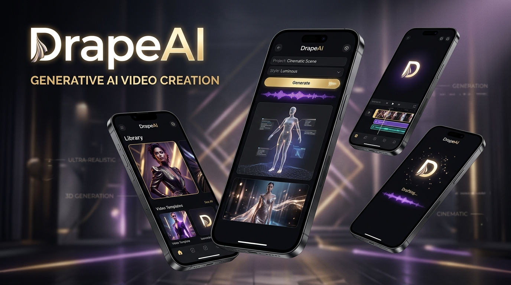
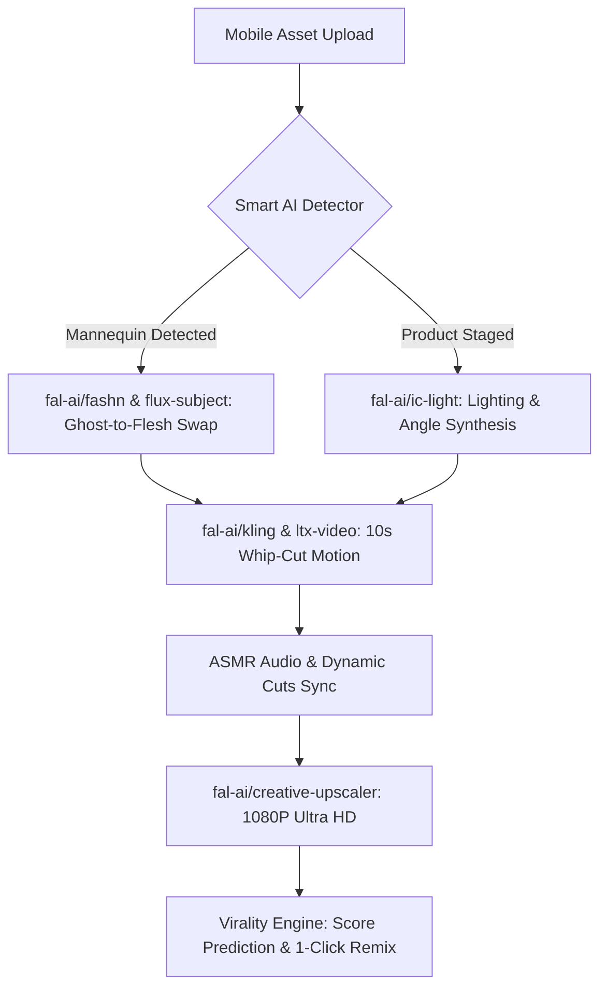
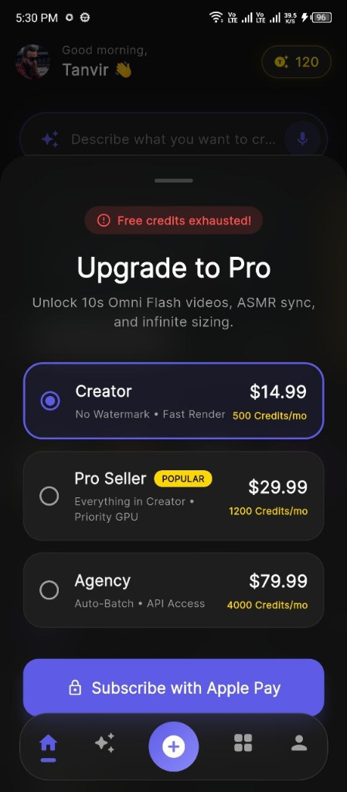

# 🎬 DrapeAI — The Next-Gen AI Product Studio & Video Virality Engine

<p align="center">
  
</p>

<p align="center">
  <strong>Transform raw product photos and mannequin shots into high-converting 9:16 TikTok, Reels & Shorts video ads in seconds.</strong><br>
  Built with Flutter • Engineered for high-throughput mobile e-commerce • Powered by <strong>fal.ai</strong>
</p>

<p align="center">
  <a href="#key-features">Key Features</a> •
  <a href="#falai-model-architecture">fal.ai Model Architecture</a> •
  <a href="#mobile-experience--ux">Mobile UX</a> •
  <a href="#architecture--tech-stack">Tech Stack</a> •
  <a href="#getting-started">Getting Started</a> •
  <a href="#partnership--vision">fal.ai Partnership Vision</a>
</p>

---

## 🌟 Overview

**DrapeAI** is an AI-first mobile studio crafted specifically for next-generation DTC brands, Amazon/Shopify sellers, and TikTok Shop creators. 

Instead of traditional expensive photo shoots or complex desktop video editors, DrapeAI enables sellers to upload a basic product or mannequin photo and produce:
1. **Ghost-to-Flesh Mannequin Swaps** with real human diversity and infinite sizing (XS–XL).
2. **10-Second High-Energy Vertical Video Ads** featuring camera whip-cuts, UE5 lighting, and tactile ASMR audio sync.
3. **Virality Score Estimations** powered by TikTok algorithm heuristics, predicting viral odds and suggesting actionable edits before publishing.

---

## ⚡ fal.ai Model Architecture

DrapeAI leverages **fal.ai**'s ultra-fast serverless inference infrastructure to deliver real-time, low-latency generative pipelines directly to mobile devices:

| Feature | fal.ai Model Endpoint | Description & Integration |
| :--- | :--- | :--- |
| **Omni Flash Video Ads** | `fal-ai/kling-video/v1/standard` & `fal-ai/ltx-video` | Generates 10-second vertical 9:16 video sequences with realistic motion, cinematic framing, and rapid transitions. |
| **Ghost Mannequin / Virtual Try-On** | `fal-ai/fashn/tryon` & `fal-ai/flux-subject` | Seamlessly detects hollow/plastic mannequins, extracts apparel geometry, and drapes it onto diverse human models across body types. |
| **Lighting & Aesthetic Staging** | `fal-ai/ic-light` + `fal-ai/flux-realism` | Allows sellers to adjust light angle and mood (e.g. *DreamWorks Realism*, *Studio Minimalist*, *Cyberpunk Neon*) using a tactile mobile joystick. |
| **E-Commerce Background & Shadows** | `fal-ai/birefnet` | Instant, pixel-perfect edge segmentation and soft drop-shadow generation for marketplace readiness (Amazon, Shopify, Daraz). |
| **Ultra HD 1080P Upscaling** | `fal-ai/creative-upscaler` | Real-time super-resolution enhancing fabric textures, stitching, and product details for crystal-clear mobile playback. |



---

## 🚀 Key Features

### 1. 2026 Creator Studio (Voice-to-Video)
- **Ambient Voice Prompting:** Speak your creative vision directly into the app; animated pulsing audio visualizers translate speech into optimized video prompts.
- **Ghost-to-Flesh Swapping:** One-tap detection and replacement of plastic mannequins with photorealistic models.
- **Tactile Sound & Cut Synthesis:** Choose from preset audio-video pairings such as *Mechanical Clicks (DIY & Builds)* or *Heavy Denim + Whip-Cuts*.
- **Tactile Light Joystick:** Interactive directional control mapped to `ic-light` prompts.

### 2. The Virality Engine (Score & Prediction)
- **Predictive Gauge (e.g. 87/100):** Real-time score estimating TikTok & Reels reach potential.
- **Actionable Optimization Tips:** Intelligent suggestions such as *"Add a trending ASMR track to push this to 95+ score"*.
- **9:16 High-Performance Player:** Instant video preview with 1080P badge, Export, Remix, and Edit actions.

### 3. 1-Click Remix Feed
- **Viral Community Inspiration:** Explore top-performing creative templates (e.g., *Matchbox Chopper DIY*, *Mini Smart Lock Assemble*).
- **1-Click Remix:** Clone camera angles, prompts, audio cues, and style models instantly into the Studio workspace.

### 4. Subscription & Billing Architecture
- **Tiered Subscriptions:** Integrated with Google Play In-App Billing for Creator, Pro Seller (Popular), and Agency tiers.
- **Credit Metering:** Live credit consumption dashboard, usage ledger history, and instant top-ups.

---

## 📱 Mobile Experience & UX

<p align="center">
  
</p>

- **Aesthetic:** Deep stealth dark mode (`#121212` background, `#1E1E1E` surface) with electric indigo accents (`#5E5CE6`) and golden credit highlights (`#FFD700`).
- **Glassmorphism:** Live dynamic blur overlays (`BackdropFilter` with `ImageFilter.blur`) for navigation bars and modal bottom sheets.
- **Micro-Animations:** Fluid transitions powered by `flutter_animate` (spring scales, gradient shimmers, and reactive physics-based lists).

---

## 🛠 Tech Stack

- **Framework:** [Flutter](https://flutter.dev) (Dart 3.x, Android & iOS Cross-Platform)
- **Routing:** [GoRouter](https://pub.dev/packages/go_router) with `StatefulShellRoute` for state-preserved tab navigation
- **Animations:** [flutter_animate](https://pub.dev/packages/flutter_animate)
- **Typography:** Google Fonts ([Inter](https://fonts.google.com/specimen/Inter))
- **Inference Cloud:** [fal.ai](https://fal.ai) Client SDK & REST Endpoints
- **Payments:** Google Play Billing / In-App Purchases

---

## 📂 Project Structure

```
lib/
├── core/
│   ├── router/
│   │   └── app_router.dart          # Stateful navigation graph & root modal routes
│   └── theme/
│       └── app_theme.dart           # Unified dark theme tokens & typography
├── features/
│   ├── splash/                      # 3.2s animated splash screen
│   ├── onboarding/                  # Multi-step creator intro & walkthrough
│   ├── auth/                        # Ambient glowing OAuth & email sign-in
│   ├── main_layout/                 # Floating glassmorphic bottom navigation bar
│   ├── home/                        # Hero carousel, compact tools & 1-Click Remix feed
│   ├── studio/                      # Creator studio, voice-to-video & virality preview
│   │   ├── studio_screen.dart       # Tactile workspace controls
│   │   ├── generation_progress_screen.dart # Real-time AI render steps
│   │   └── result_preview_screen.dart # 9:16 player & virality score gauge
│   ├── tools/                       # AI tools directory & category chip filtering
│   ├── library/                     # User-generated video & image gallery
│   └── profile/                     # Profile, usage history, settings & subscription
│       ├── settings_screen.dart     # Render quality and notification toggles
│       ├── usage_history_screen.dart# Transaction ledger for video credits
│       ├── help_support_screen.dart # Status check & FAQ expansion cards
│       ├── manage_subscription_screen.dart # Plan details & payment info
│       └── subscription/
│           └── subscription_sheet.dart # Glassmorphic Google Play bottom sheet
└── main.dart                        # App entry point
```

---

## 🚀 Getting Started

### Prerequisites
- [Flutter SDK](https://docs.flutter.dev/get-started/install) (v3.24+ recommended)
- Android Studio / VS Code with Flutter extension
- A [fal.ai](https://fal.ai) account and API key

### Installation

1. **Clone the repository:**
   ```bash
   git clone https://github.com/niloyhakimdev/DrapeAi.git
   cd DrapeAi
   ```

2. **Install Flutter dependencies:**
   ```bash
   flutter pub get
   ```

3. **Configure fal.ai API Key:**
   Create an environment configuration file or set your key in `android/local.properties` or `.env`:
   ```bash
   FAL_KEY=your_fal_ai_api_key_here
   ```

4. **Run on connected device / emulator:**
   ```bash
   flutter run
   ```

---

## 🤝 fal.ai Partner Program Vision

DrapeAI is built with a deep commitment to **fal.ai**'s model ecosystem:
- **High API Request Volume:** Every video ad generation utilizes a chain of 3–4 fal.ai endpoints (segmentation, try-on, video diffusion, and upscaling), resulting in substantial API consumption per active creator.
- **Showcase of Real-World fal.ai Capabilities:** Demonstrating how cutting-edge video models (Kling, LTX-Video, Wan 2.1) solve concrete commercial problems for global e-commerce sellers on mobile.
- **Fast Feedback Loop:** We continuously benchmark generation times, frame coherence, and mobile webhook delivery to help improve fal.ai client-side integration patterns.

---

## 📄 License
This project is proprietary software developed for the DrapeAI Creator Platform. All rights reserved.
